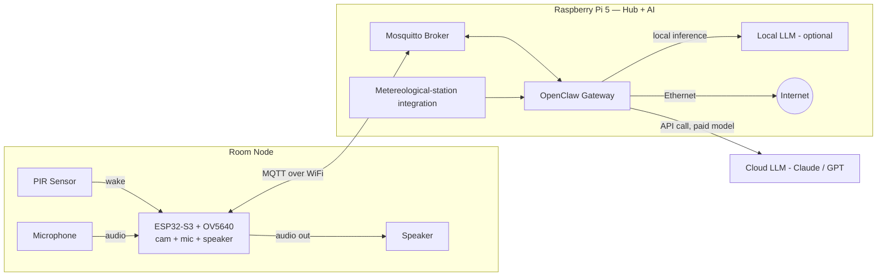
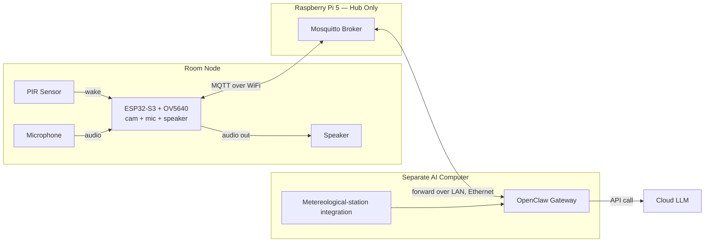
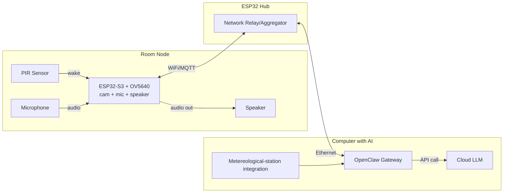
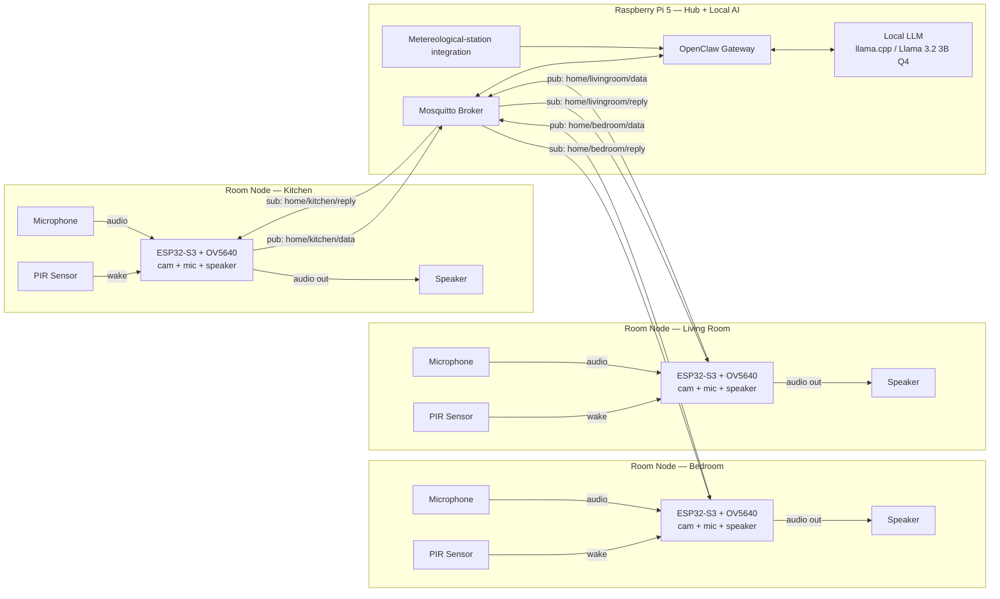
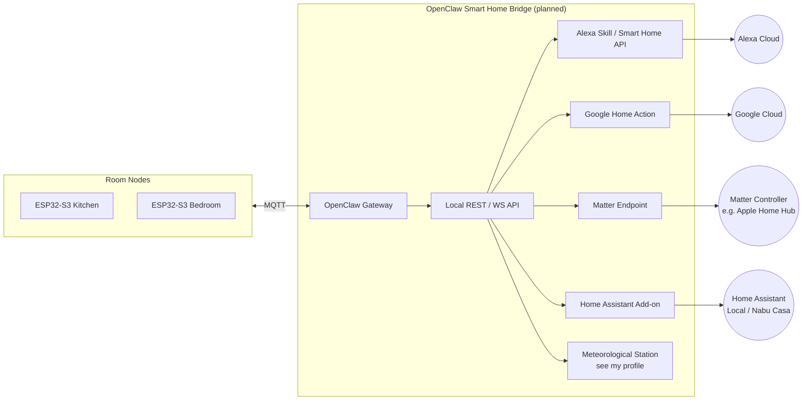

# 🏠 Ultrax Home Assistant


> **An open-source AI home assistant that can see you, hear you, and help you with anything — room by room.**

<picture>
  <source media="(prefers-color-scheme: dark)" srcset="https://github.com/user-attachments/assets/9c174ef7-c363-4122-a212-2fffc3c5c515">
  <source media="(prefers-color-scheme: light)" srcset="https://github.com/user-attachments/assets/f1a5fe65-339a-4f74-b0fc-78669dc42ed9">
  
</picture>

Each room gets its own ESP32-S3 node (camera, mic, speaker). All nodes talk to a central hub (Raspberry Pi 5 or another ESP32), which runs or forwards to [OpenClaw](https://github.com/) — the gateway that connects everything to an AI model, local or cloud.

---

> [!WARNING]
> This project is under active development. APIs, MQTT schemas, and hardware pinouts **may change without notice**. Do not use in production environments.

> [!NOTE]
> If you have a Raspberry Pi 5 lying around, Setup 1 is the easiest path — you can run everything on it, fully offline, for free.

---

## 📑 Table of Contents

- [How It Works](#how-it-works)
- [Hardware](#hardware)
  - [Bill of Materials](#bill-of-materials)
- [Setups](#setups)
  - [Setup 1 — Pi 5 as Hub + AI Host](#setup-1--pi-5-as-hub--ai-host)
  - [Setup 2 — Pi 5 as Hub Only](#setup-2--pi-5-as-hub-only-relay-to-a-separate-ai-computer)
  - [Setup 3 — ESP32 Hub](#setup-3--esp32-hub-relay-to-a-computer-with-ai)
  - [Practical Example — 3 Rooms](#practical-example--3-rooms-pi-5-with-local-ai-only)
- [MQTT Topic Schema](#mqtt-topic-schema)
- [Getting Started](#getting-started)
- [Smart Home Integration (Roadmap)](#smart-home-integration-roadmap)
- [Contributing](#contributing)
- [License](#license)

---

## How It Works

Every room has a **Room Node** — a single ESP32-S3 board with a camera, microphone, and speaker attached. A PIR sensor watches for motion; when someone enters the room, the node wakes up, captures audio and a photo, and publishes the data to an MQTT broker running on your hub.

The hub (Pi 5 or ESP32) forwards the data to **OpenClaw**, which decides whether to answer using a local LLM (fast, offline, free) or route it to a paid cloud model like Claude or GPT (for anything requiring reliability or tool-calling). The response comes back through the broker and the room's own speaker plays it — no other room is affected.

```
PIR triggers → ESP32-S3 wakes → captures audio + photo
  → publishes to MQTT → OpenClaw processes → AI responds
  → response published back → ESP32-S3 speaks the answer
```

---

## Hardware

### Bill of Materials

One **Room Node** requires:

| Component | Description | Qty | Notes |
| :--- | :--- | :---: | :--- |
| ESP32-S3 | Main microcontroller | 1 | Must be S3 variant (has enough RAM for camera) |
| OV5640 | Camera module | 1 | 5MP, connects via DVP or MIPI |
| INMP441 | I2S microphone | 1 | Or any I2S-compatible mic |
| MAX98357A | I2S audio amplifier | 1 | Drives a small 3W speaker |
| Speaker | 4Ω or 8Ω, ≥2W | 1 | Any small enclosure works |
| HC-SR501 | PIR motion sensor | 1 | Adjustable sensitivity and delay |
| 5V power supply | USB-C or barrel jack | 1 | ≥2A recommended |

One **Hub** requires (pick one):

| Option | Hardware | Best For |
| :---: | :--- | :--- |
| A | Raspberry Pi 5 (4 GB or 8 GB) | Running OpenClaw locally + optional local LLM |
| B | Any Linux PC / mini PC | More compute for larger local models |
| C | ESP32 (non-S3) | Relay-only, no AI on-device |

> [!TIP]
> For local inference, an 8 GB Pi 5 can run Llama 3.2 3B at Q4 quantization comfortably. For anything larger, route to a separate computer or use a cloud model.

---

## Setups

### Setup 1 — Pi 5 as Hub + AI Host

The Raspberry Pi 5 receives data directly from the room nodes over WiFi/MQTT and **also runs OpenClaw itself**. OpenClaw can use either a local model (fully offline, for light/casual queries) or a paid cloud model (Claude/GPT) for anything that needs reliability and tool-calling.



| Pros | Cons |
| :--- | :--- |
| Single device does everything | Pi 5 is the bottleneck for compute |
| Easy to set up | Large models need the 8 GB variant |
| Can work fully offline | |

---

### Setup 2 — Pi 5 as Hub Only (Relay to a Separate AI Computer)

The Raspberry Pi 5 only aggregates the room nodes and runs the MQTT broker. It **does not run OpenClaw** — it forwards everything over LAN (wired) to a separate, more powerful computer that runs OpenClaw and handles the actual AI logic.



| Pros | Cons |
| :--- | :--- |
| Offloads all compute to a real PC | Requires two devices |
| Pi 5 stays cool and light | LAN cable needed for low latency |

---

### Setup 3 — ESP32 Hub (Relay to a Computer with AI)

A dedicated ESP32 (instead of the Pi 5) acts as the network hub, collecting data from the room nodes over WiFi and forwarding it over a wired Ethernet backbone to a separate computer running OpenClaw. Useful when the AI computer isn't in reliable WiFi range of every room.

> [!WARNING]
> The ESP32 Hub variant has **no local AI capability** — it is a relay only. All intelligence lives on the connected computer.



| Pros | Cons |
| :--- | :--- |
| Cheapest hub option | No offline/local AI |
| Very low idle power draw | ESP32 Ethernet shields vary in quality |

---

### Practical Example — 3 Rooms, Pi 5 with Local AI Only



**Walkthrough:**

1. Someone walks into the kitchen → the PIR sensor wakes that room's ESP32-S3 (camera, mic, and speaker all activate).
2. The ESP32-S3 captures audio + a still photo and publishes it to `home/kitchen/data`.
3. OpenClaw picks it up from the broker and resolves the request against the local LLM — no internet round-trip needed.
4. OpenClaw publishes the reply to `home/kitchen/reply`.
5. The kitchen ESP32-S3 receives it and speaks the answer through its speaker.
6. The bedroom and living room nodes stay completely idle — each only wakes when its own PIR triggers.

---

## MQTT Topic Schema

All topics follow the pattern: `home/<room>/<direction>`

| Topic | Direction | Publisher | Subscriber | Payload |
| :--- | :---: | :--- | :--- | :--- |
| `home/<room>/data` | → hub | ESP32-S3 | OpenClaw | Audio + image (base64 or chunked binary) |
| `home/<room>/reply` | → node | OpenClaw | ESP32-S3 | Text string (TTS handled on-device) |
| `home/<room>/status` | → hub | ESP32-S3 | Hub/OpenClaw | JSON: `{ "awake": true, "battery": 98 }` |
| `home/hub/command` | → all nodes | OpenClaw | All ESP32-S3 | JSON: `{ "target": "kitchen", "cmd": "sleep" }` |

> [!NOTE]
> `<room>` is a lowercase slug you define per node (e.g. `kitchen`, `bedroom`, `living_room`). Keep it consistent across your firmware and your OpenClaw config.

> [!WARNING]
> The current schema does **not** include authentication or payload encryption. Do **not** expose your MQTT broker to the public internet without adding TLS + username/password to Mosquitto first.

---

## Getting Started

> [!NOTE]
> These steps assume **Setup 1** (Pi 5 as hub + AI host). Adjust accordingly for other setups.

### Prerequisites

- Raspberry Pi 5 running Raspberry Pi OS (64-bit, Bookworm or later)
- Python 3.11+
- `mosquitto` and `mosquitto-clients` installed
- At least one assembled Room Node (see [Bill of Materials](#bill-of-materials))
- An Anthropic or OpenAI API key **if** you want cloud model fallback (optional)

### 1 — Install Mosquitto on the Pi

```bash
sudo apt update && sudo apt install -y mosquitto mosquitto-clients
sudo systemctl enable mosquitto
sudo systemctl start mosquitto
```

### 2 — Clone this repo

```bash
git clone https://github.com/your-username/ultrax-home-assistant.git
cd ultrax-home-assistant
```

### 3 — Install OpenClaw

Follow the [OpenClaw setup guide](https://github.com/) for your platform. Then copy the example config:

```bash
cp config/openclaw.example.yaml config/openclaw.yaml
```

Edit `config/openclaw.yaml` and set your broker address, room list, and (optionally) your cloud API key.

### 4 — Flash the Room Node firmware

Open the `firmware/` folder in your IDE of choice (PlatformIO recommended). Set your WiFi credentials and broker IP in `firmware/src/config.h`:

```c
#define WIFI_SSID     "your-ssid"
#define WIFI_PASS     "your-password"
#define MQTT_BROKER   "192.168.1.100"   // your Pi's local IP
#define ROOM_NAME     "kitchen"         // change per node
```

Then build and flash to the ESP32-S3.

### 5 — Start OpenClaw

```bash
python3 -m openclaw --config config/openclaw.yaml
```

Walk in front of a room node — the PIR should trigger, the node should publish to the broker, and OpenClaw should respond within a few seconds.

> [!TIP]
> Use `mosquitto_sub -h localhost -t "home/#" -v` on the Pi to watch all MQTT traffic in real time — great for debugging.

---

## Smart Home Integration (Roadmap)

Integration with **Alexa, Google Home, Apple HomeKit, and Matter** is planned for a future release. The rough architecture is outlined below.

### Concept: OpenClaw as a Smart Home Bridge

OpenClaw will expose a local **REST + WebSocket API** that smart home platforms can talk to. Room nodes remain unchanged — the bridge layer sits between OpenClaw and the platform's cloud (or local hub, in the case of Matter/Home Assistant).



**Planned milestone breakdown:**

| Milestone | Target | Status |
| :---: | :--- | :---: |
| M1 | OpenClaw local REST API | 🔲 Planned |
| M2 | Home Assistant add-on (HACS) | 🔲 Planned |
| M3 | Matter bridge endpoint | 🔲 Planned |
| M4 | Alexa Smart Home Skill | 🔲 Planned |
| M5 | Google Home Action | 🔲 Planned |

> [!NOTE]
> Matter support (M3) is the highest priority after Home Assistant, since it covers Apple Home, Google Home, and Amazon Alexa simultaneously through a single open standard — no per-platform cloud integration needed.

---

## Contributing

Contributions are very welcome — hardware pinouts, firmware improvements, new OpenClaw integrations, docs, anything.

1. Fork the repo
2. Create a feature branch: `git checkout -b feat/your-feature`
3. Commit your changes: `git commit -m "feat: describe your change"`
4. Push and open a Pull Request against `main`

Please open an issue first for anything larger than a bug fix, so we can discuss direction before you invest time building it.

> [!IMPORTANT]
> When contributing firmware changes, always test on real hardware before submitting a PR. Simulated builds are not a substitute — the ESP32-S3 camera stack behaves differently under real WiFi load.

---

## License

This project is licensed under the **MIT License**. See [LICENSE](./LICENSE) for the full text.

---
