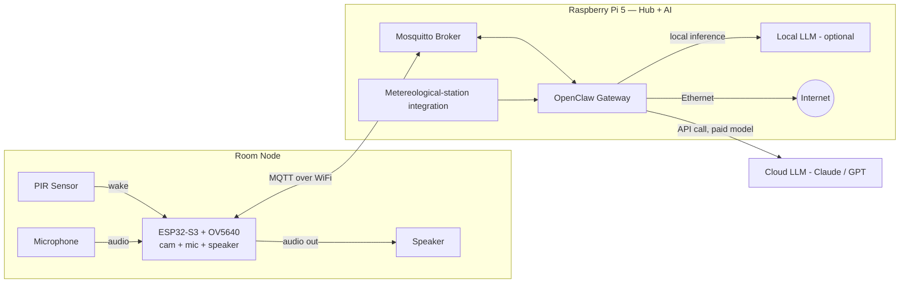
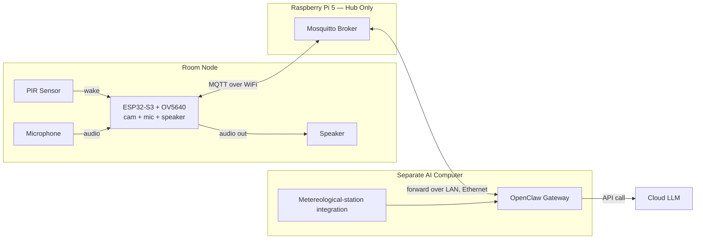
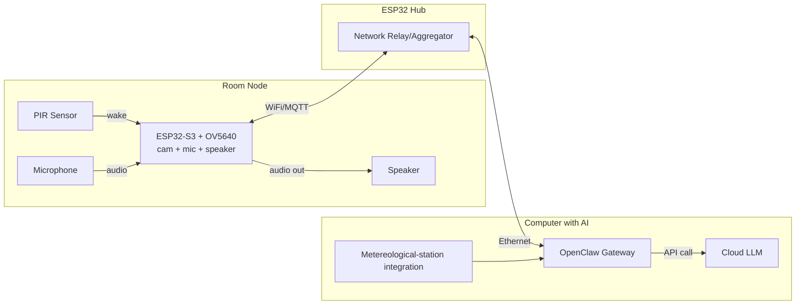

# Ultrax Home Assistant

Ultrax Home Assistant is a project for an AI assistant that can see you, hear you, and help you with anything.

## Sketch

The plan is to place one ESP32 in each room of the house, sending all camera and microphone data to a central Raspberry Pi 5 or ESP32. If you have a Raspberry Pi 5 lying around, I recommend using it so you can run your own offline, completely free AI. You can also run OpenClaw with a paid model, or use the Pi to pass data to a computer running OpenClaw—just as the ESP32 would do.

## Room Node (shared by all setups)

- PIR sensor wakes the ESP32-S3 (camera, mic, and speaker all go active together)
- After waking, the node captures ~2 photo/sec and listens for a command
- The ESP32-S3 publishes audio/image data to the broker, and subscribes to a response topic
- Any response/command from the hub goes back to the ESP32-S3, which drives the speaker itself

I created flowcharts for all the setups to make them easier to understand.

Setup 1

Setup 1 — Pi 5 as Hub + AI Host

The Raspberry Pi 5 receives data directly from the room nodes over WiFi/MQTT and also runs OpenClaw itself. OpenClaw can use either a local model (fully offline, for light/casual queries) or a paid cloud model (Claude/GPT, for anything that needs reliability and tool-calling).

Setup 2

Setup 2 — Pi 5 as Hub Only (Relay to a Separate AI Computer)

The Raspberry Pi 5 only aggregates the room nodes and runs the MQTT broker. It does not run OpenClaw itself — it forwards everything over the LAN (wired) to a separate, more powerful computer that runs OpenClaw and handles the actual AI logic.

Setup 3

Setup 3 — ESP32 Hub (Relay to a Computer with AI)

A dedicated ESP32 (instead of the Pi 5) acts as the network hub, collecting data from the room nodes over WiFi and forwarding it over a wired Ethernet backbone to a separate computer running OpenClaw. Useful when the AI computer isn't in reliable WiFi range of every room.

Practical example

Example — 3 Rooms, Pi 5 with Local AI Only

**Walkthrough:**

1. Someone walks into the kitchen → the PIR sensor there wakes that room's ESP32-S3 (camera, mic, and speaker all activate).
2. The ESP32-S3 captures audio + a still photo and publishes it to `home/kitchen/data`.
3. OpenClaw picks it up from the broker, resolves the request against the local LLM (e.g. "what's a good cake recipe?") — no internet round-trip needed.
4. OpenClaw publishes the reply to `home/kitchen/reply`.
5. The kitchen's ESP32-S3 receives it and speaks the answer through its own speaker.
6. Meanwhile, the bedroom and living room nodes stay idle — each only wakes and talks to the broker when its own PIR triggers, using its own room-specific topics, so the three rooms never interfere with each other.

